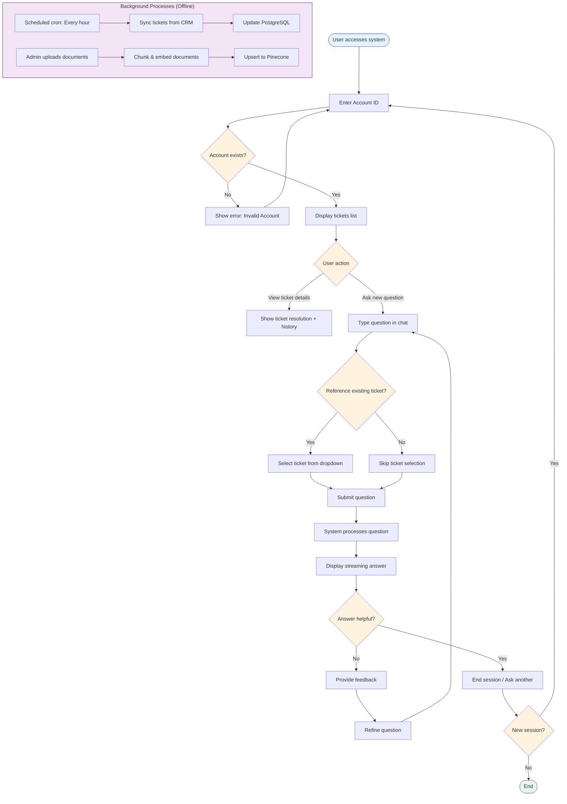
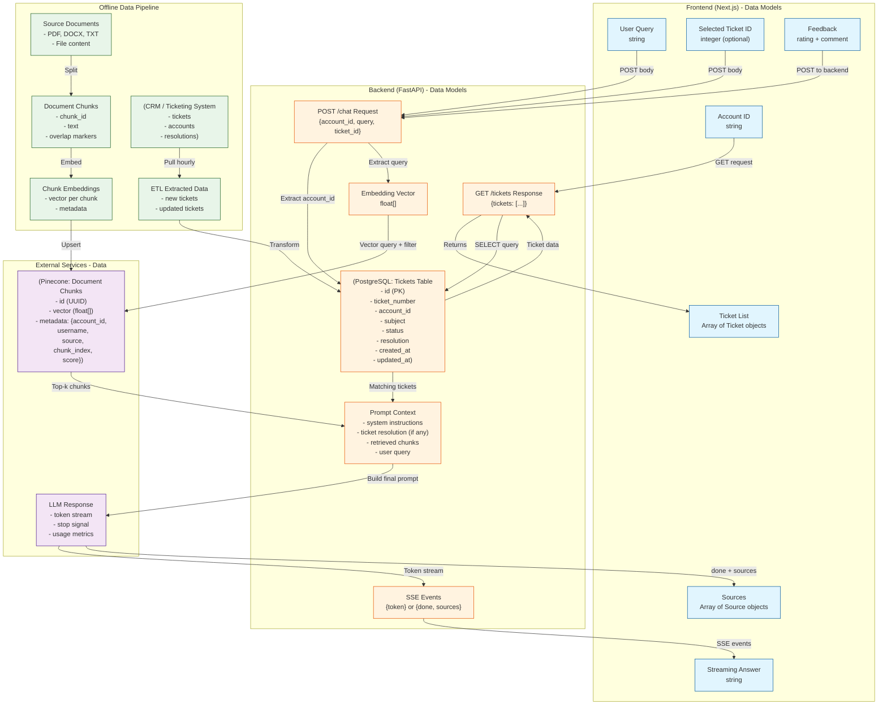

# AI Agent - Azure ASR Migrate AI Agent - Product Requirements Document (PRD)

## 0. Document Information
### 0.1 Document Status
- Current Version: Draft 1.1.0
- Current Stage: Requirements Review 
- Created By: Eva Liu
- Creation Date: 2026-06-17
- Last Updated: 2026-06-17
- Key Stakeholders: product engineer team lead, development team lead, business operation team lead.

### 0.2 Revision History

| Version | Version Status | Update Date | Updated by | Core Updates |
|---------|--------|--------|--------|--------|
| 1.0.0   | Initial Requirements Draft | 2026-06-09 | Eva Liu | Initial description of the requirement background, goals, and core values. |
| 1.1.0   | Updated Requirements Draft | 2026-06-17 | Eva Liu | Updated requirements for building Azure ASR Migrate AI Agent. |

### 0.3 Related Documents
- Technical Solution Design Document: [link here]

### 0.4 Glossary

| Term | Definition |
|------|------|
| ASR  | Azure Site Recovery Service |

## 1. Requirement Background and Goals
### 1.1 Project Overview
This project is aim to build an AI Agent for supporting users' technical requests for Azure Site Recovery service and Azure Migrate Service.

### 1.2 Core Problem to Solve
1. **Target User Profiles**: operation engineers, solution architect, new product tryout user.
2. **User Scenario**: when users having questions, issues, error messages, requests for improvement when they using Azure Site Recovery Service and Azure Migrate.
3. **Core Pain Points**:
    1. Long first response time: the current mechanism routes all the user request tickets to backend pool for human support, it takes long time to get the first response.
    2. User request variation: different users have different issues related to different product perspectives.
    3. Low overall system efficiency: the current system has different support engineers handle the same issue from different users, it wastes the resources and time for the same response.
    4. Lack of past user request information: the same user will have different support engineer to handle their requests each time, but the support engineer is lack of user's past request information and solution preference.

### 1.3 User Stories
- **Story 1:** As a product first tryout user, I want to know how to delete a Recovery Service Vault after I run VM failover. So that I don't have to worry about the potential costs afterwards.
- **Story 2:** As an operation engineer, I run into this error message while doing test failover, the VM is not creating properly in the secondary region, I need to fix this issue and make sure the VM up and running successfully before doing real failover operation.
- **Story 3:** As a solution architect, I am helping with clients to design a migration strategy from on-prem VMware VM to Azure. I need to know how to design the overall architecture to utilize performance, operation efficiency and cost.

### 1.4 Project Goals and Value
- **User Value**: get faster first time response, improve overall experience, have customized solutions.
- **Business Value**: increase user satisfaction rate, increase ticket response efficiency, lower operational cost.
- **Project Goals**:
  - Specific: After launch, get user first response time improved by 50%. Increase user satisfaction rate by 30%.
  - Measurable - KPIs:
    - Resolution Rate: % of conversations where the AI Agent fully answers the question without human escalation.
    - CSAT (Customer Satisfaction): Post-chat rating 1-5.
    - First Response Time: Time from user message to AI Agent's first response.
    - Avg. Handle Time: Duration from start to resolution.
    - Escalation Rate: % of conversations transferred to human support.
  - Achievable: Based on existing resources and technical capabilities, the first two user stories can be completed by AI Agent.
  - Relevant: This goal aligns with the company's strategic direction of "improving user efficiency".
  - Time-bound: To be achieved within 3 months after launch.

### 1.5 Scope
- **In-Scope**:
    1. User requests simple fundamental question about Azure Site Recovery Service and Azure Migrate.
    2. User requests simple operation related procedures about how to perform certain task using Azure Site Recovery Service and Azure Migrate.
- **Out-of-Scope**:
    1. User provides an error code or error message after performing certain procedures. User wants to fix this.
    2. User wants to improve functionality that integrates with more than one Azure product.
    3. User wants a better architectural design that utilizes overall performance, functionality, stability, and cost.

## 2. Solution Overview
### 2.1 Core Business Flowchart

### 2.2 Core Feature Flowchart
1. For basic fundamental question:
AI Agent gets user question -> AI Agent searches the question in backend knowledge base and official webpage -> AI Agent provides the response/If nothing found, escalates to human support

2. For operation related procedures
AI Agent gets user question -> AI Agent searches product manual and development handbook -> AI Agent provides the response/If nothing found, escalates to human support

### 2.3 Information Architecture Diagram

## 3. Detailed Solution
### 3.1 UX Requirements
- Web Chat interface space: overall color and style need to be aligned with Azure product page. 
- Conversation flow diagram: Users start request -> Users get response/or input more information related -> Request Handled by AI Agent -> Conversation Finished
- Conversation tone: technical, focus on technical solutions and details.
- Language: English.

### 3.2 Technical Architecture
- Recommended tech stack:
- **Frontend**: Next.js (client-side, calls backend)
- **Backend**: FastAPI (API route) + Python (Business Logic)
- **Vector DB**: Pinecone
- **Relational DB**: PostgreSQL (store user data and tickets data)

### 3.3 Non-Functional Requirements
#### 3.3.1 Performance
- First Response Time <= 2s: measured from user message submission to first visible character response.
- Full Answer Generation Time <= 10s (level 1): level 2 requires multi-source cross referencing.
- Concurrent User Capacity >= 1000 sessions: support enterprise-scale usage.
#### 3.3.2 Security and Compliance
- Data Isolation - Logical isolation per customer/account: each customer/account's conversation data is separated via partition keys.
- Data Encryption - AES-256/TLS 1.3: industry standard.
- Access Control - MFA + RBAC: admin access requires multi-factor authentication and role-based access control.
- Compliance - GDPR: enterprise-grade compliance.
#### 3.3.3 Reliability
- Graceful Degradation - Fallback mode if Agent unavailable: Agent provides generic response + escalation to human support.
- Error Handling - Generic user-facing messages: all errors logged internally, user see escalation message.
- Backup & Recovery - Daily backup/RTO<=4h,RPO<=1h: ensure business continuity.

## 4. Launch Plan and Operations
### 4.1 Launch Timeline
- Requirements Review: 2026-06-12
- UI/UX Design: 2026-06-13 ~ 2026-06-19
- Development Phase: 2026-06-16 ~ 2026-06-26
- Testing Phase: 2026-06-20 ~ 2026-06-28
- Expected Launch Date: 2026-06-30

### 4.2 A/B Test Plan
- **Test Objective**: Verify whether the new Web Chat can improve the user satisfaction rate.
- **Experiment Groups**:
  - Group A (Control Group): Use the older human support ticket.
  - Group B (Experiment Group): Use the new Web Chat.
- **Traffic Allocation**: Group A 50%, Group B 50%
- **Core Metrics**:
  - Resolution Rate
  - CSAT (Customer Satisfaction)
  - First Response Time
- **Launch/Rollback Criteria**: If Group B significantly outperforms Group A on the core metric and there are no negative indicators, roll out to all users.

