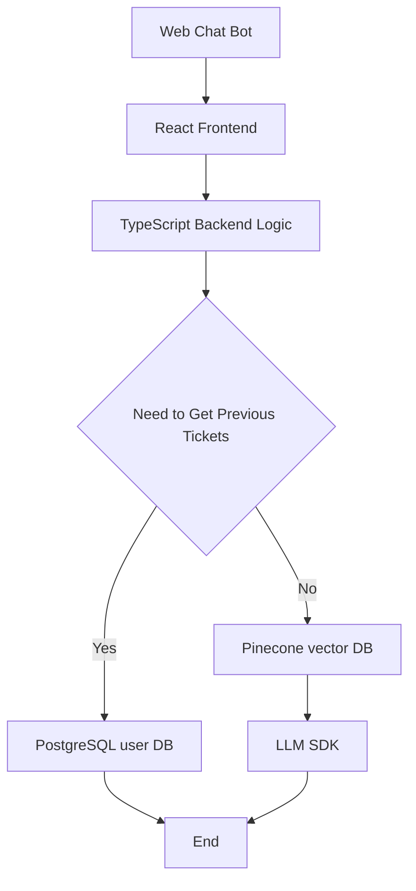
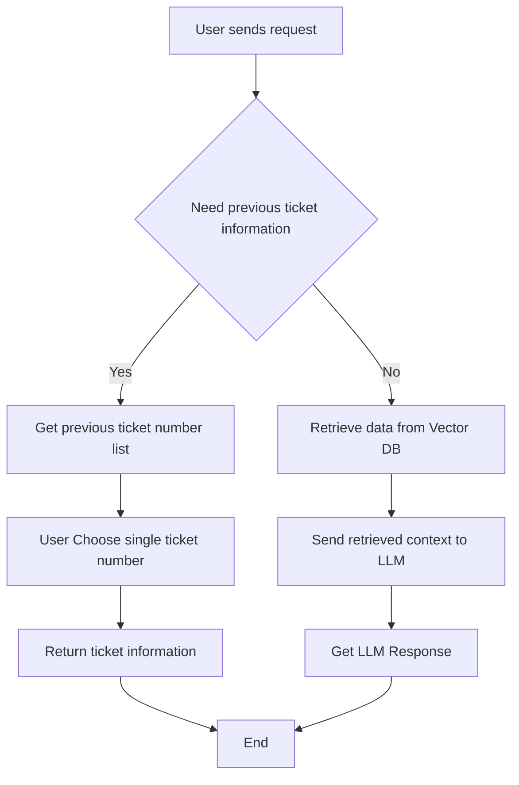

# AI Agent - Azure ASR Migrate AI Agent - Technical Documentation

## 0. Document Information
### 0.1 Document Status
- Current Version: Draft 1.0.0
- Current Stage: Technical Documentation Review 
- Created By: Eva Liu
- Creation Date: 2026-06-10
- Last Updated: 2026-06-10
- Key Stakeholders: product engineer team lead, development team lead, business operation team lead.

### 0.2 Revision History
| Version | Version Status | Update Date | Updated by | Core Updates |
|---------|--------|--------|--------|--------|
| 1.0.0  | Initial Tech Documentation Draft | 2026-06-09 | Eva Liu | Initial Technical Documentation for building Azure ASR Migrate AI Agent. |

## 1. Data Model
### 1.1 Vector Database
- Vector Database Decision: Pinecone
- Functionality: Use Pinecone Vector DB to store internal documentation.

#### 1.1.1 Vector DB Metadata
- file_name
- path
- chunk_index
- content
- original_row_index

### 1.2 Relational Database
- Relational Database: PostgreSQL
- Functionality: Use PostgreSQL to store User data, historical tickets number.

#### 1.2.1 Users Table (users)
- account_id: Primary key
- email: Email (unique)
- name: Display name
- created_at: Creation timestamp
- historical_tickets: Historical tickets numbers (list)

#### 1.2.2 Ticket Table (tickets)
- ticket_number: Primary key
- account_id: User Account number
- name: User name
- issue: Ticket name
- created_at: Creation timestamp
- solutions: Solution provided previously about this ticket

Relationship: One user can have many tickets(one-to-many)

## 2. API Design
Note: For this version technical documentation, there is no need to build another layer of API on top of LLM SDK. But several services will be needed in the backend business logic code.

## 3. Architecture Diagram
### 3.1 Architecture Diagram

### 3.2 Flowchart Diagram

## 4. Third-Party Integrations
### 4.1 OpenAI API
- Purpose: AI conversation features
- Environment variable: OPENAI_API_KEY, OPENAI_BASE_URL
- Limitation: 60 requests per minute

## 5. Technical Decisions
### 5.1 Stack
- **Frontend**: React (client-side, calls backend)
- **Backend**: TypeScript (Node.js server)
- **Vector DB**: Pinecone
- **Relational DB**: PostgreSQL (store user data and tickets data)

### 5.2 Database Hosting
- **Relational DB**: PostgreSQL (AI has deep understanding, generating accurate data model code)
