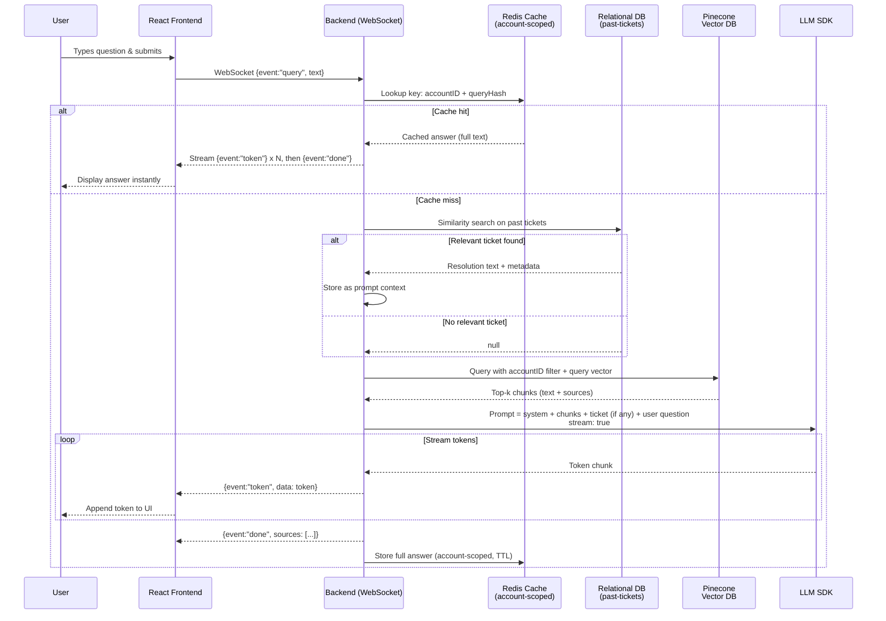

# AI Agent - Azure ASR Migrate AI Agent - Technical Documentation

## 0. Document Information
### 0.1 Document Status
- Current Version: Draft 1.1.0
- Current Stage: Technical Documentation Review 
- Created By: Eva Liu
- Creation Date: 2026-06-11
- Last Updated: 2026-06-11
- Key Stakeholders: product engineer team lead, development team lead, business operation team lead.

### 0.2 Revision History
| Version | Version Status | Update Date | Updated by | Core Updates |
|---------|--------|--------|--------|--------|
| 1.0.0  | Initial Tech Documentation Draft | 2026-06-10 | Eva Liu | Initial Technical Documentation for building Azure ASR Migrate AI Agent. |
| 1.1.0  | Updated Tech Documentation Draft | 2026-06-11 | Eva Liu | Updated Technical Documentation for building Azure ASR Migrate AI Agent. |


## 1. Data Model
### 1.1 Vector Database
- Vector Database Decision: Pinecone
- Functionality: Use Pinecone Vector DB to store internal documentation.

#### 1.1.1 Vector DB Metadata
- file_name
- path
- chunk_index
- content
- original_row_index

### 1.2 Relational Database
- Relational Database: PostgreSQL
- Functionality: Use PostgreSQL to store User data, historical tickets number.

#### 1.2.1 Users Table (users)
- account_id: Primary key
- email: Email (unique)
- name: Display name
- created_at: Creation timestamp
- historical_tickets: Historical tickets numbers (list)

#### 1.2.2 Ticket Table (tickets)
- ticket_number: Primary key
- account_id: User Account number
- name: User name
- issue: Ticket name
- created_at: Creation timestamp
- solutions: Solution provided previously about this ticket

Relationship: One user can have many tickets(one-to-many)

### 1.3 Semantic Cache
- Semantic Cache: Redis
- Functionality: For user-scoped, short-term answer reuse.
  

## 2. API Design
Note: For this version technical documentation, there is no need to build another layer of API on top of LLM SDK. But several services will be needed in the backend business logic code.


## 3. Architecture Diagram
Here we design a RAG system for retrieving internal documents as referenced context.

### 3.1 Data Flow Explanation
#### 3.1.1 Online Query Path (real-time, event driven)
1. **Connect** - React frontend opens a WebSocket connection to the backend's WebSocket server.
2. **Send Question** - User type a question; frontend sends a `{event: 'query', text: 'content'}` message.
3. **Check Semantic Cache** - Backend looks in Redis using account-scoped key: `cache:${accountId}:${queryHash}`
   - If found, the cached answer is sent back as a series of token events and a done event -> skip all remaining steps.
4. **Search Past Tickets (relational DB)** - On cache miss, backend performs a similarity search on the `tickets` table.
   - If a highly similar ticket is found, its resolution is saved to augment the prompt. 
5. **Get Query Embedding** - Backend calls the embedding models to convert the user's question into an embedding vector.
6. **Query Pinecone** - The vector is sent to Pinecone with a metadata filter (e.g., accountID) to retrieve only relevant document chunks.
7. **Return top-k Chunks** - Pinecone returns the most similar chunks (with metadata: source, chunk text, score).
8. **Build Prompt and call LLM** - Backend constructs a prompt containing:
   - System instructions
   - Retrieved chunks (from Pinecone)
   - The past ticket resolution (if found)
   - User question
  Then it calls the LLM SDK (e.g., `openai.chat.completions.create`).
9. **Steam Tokens** - LLM SDK yields tokens one by one. Backend forwards each token as a WebSocket `{event: 'token', data: 'content'}` message.
10. **Completion** - After the final token, backend sends `{event: 'done', sources: [...]}` with source metadata. The backend also stores the full answer in the semantic cache for a configured TTL (5h). 

#### 3.1.2 Offline Ingestion Path (asynchronous)
1. **Source Documents** - New documents (PDF, Word, etc.) are uploaded via a separate admin interface or automated pipeline.
2. **Chunking** - Documents are split into overlapping chunks (e.g., 500 tokens, overlap 50).
3. **Embedding** - Each chunk is passed to the same embedding model to generate a vector.
4. **Upsert to Pinecone** - Vectors are inserted into Pinecone DB along with metadata (accountId, username, source, chunk index, score, etc.).
5. **Past Tickets** - Support tickets are periodically extracted from the ticketing system and stored in the relational DB.
6. **Queue** - Long ingestion jobs are pushed to a message queue and processed by a background worker. This prevents blocking the online query path.


### 3.2 Architecture Diagram
```mermaid
flowchart TB
    subgraph Client ["Frontend (React)"]
        UI[User Interface]
        WS[WebSocket Client]
    end

    subgraph Backend ["Backend (Node.js)"]
        WSS[WebSocket Server]
        Cache[(Semantic Cache\nRedis - user scoped)]
        RDB[(Relational DB\nPast Tickets)]
        Queue[Job Queue\nRabbitMQ]
        Worker[Background Worker]
    end

    subgraph VectorDB ["Vector Database"]
        PC[(Pinecone Index)]
    end

    subgraph LLM ["LLM Provider"]
        OpenAI[OpenAI SDK]
    end

    subgraph Ingestion ["Offline Ingestion Pipeline"]
        Docs[Source Documents\nPDF, DOCX, TXT]
        Tickets[Past Support Tickets]
        Chunker[Chunking & Cleaning]
        Embedder[Embeddding Model]
    end

    %% Online query path (event-driven)
    UI -->|1. Connect| WS
    WS -->|WebSocket upgrade| WSS
    UI -->|'2. Send question (event:"query")'| WS
    WS --> WSS
    WSS -->|3. Check semantic cache| Cache
    Cache -->|Cache miss| WSS
    WSS -->|4. Search past tickets| RDB
    RDB -->|Found similar resolved ticket| WSS
    WSS -->|5. Get query embedding| Embedder
    Embedder -->|6. Query vector| PC
    PC -->|7. Top-k chunks| WSS
    WSS -->|8. Build prompt + chunks + ticket (if any)| OpenAI
    OpenAI -->|9. Stream tokens| WSS
    loop Each token
        WSS -->|'(event:"token", data:...)'| WS
        WS --> UI
    end
    WSS -->|'10. (event:"done", sources)'| WS
    WS --> UI

    Cache -.->|Cache hit| WSS
    WSS -.->|Store answer in cache| Cache

    %% Offline ingestion path
    Docs --> Chunker --> Embedder --> PC
    Tickets -->|Structured storage| RDB
    Tickets -.->|Optional: also chunk & embed| Chunker
    Embedder -.->|Notify completion| Queue
    Queue --> Worker
    Worker -->|Update status| WSS

    class UI, WS frontend
    class WSS, Cache, RDB, Queue, Worker backend
    class PC vector
    class OpenAI, Embedder llm
    class Docs, Tickets, Chunker ingestion
```

### 3.3 User Flowchart Diagram



## 4. Third-Party Integrations
### 4.1 OpenAI API
- Purpose: AI conversation features
- Environment variable: OPENAI_API_KEY, OPENAI_BASE_URL
- Limitation: 60 requests per minute


## 5. Technical Decisions
### 5.1 Stack
- **Frontend**: React (client-side, calls backend)
- **Backend**: TypeScript (Node.js server)
- **Vector DB**: Pinecone
- **Relational DB**: PostgreSQL (store user data and tickets data)
- **Semantic Cache**: Redis (short-term answer reuse)

### 5.2 Database Hosting
- **Relational DB**: PostgreSQL (AI has deep understanding, generating accurate data model code)
